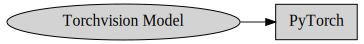
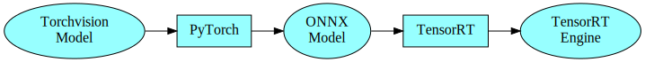
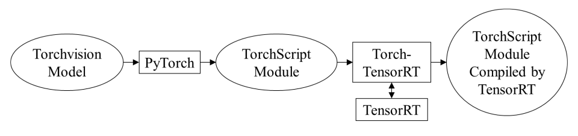
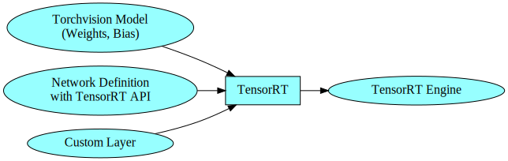
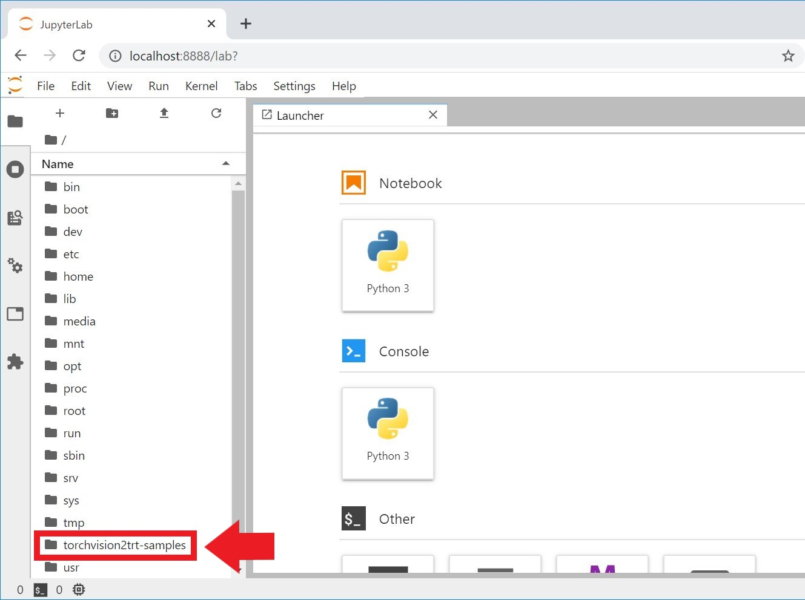
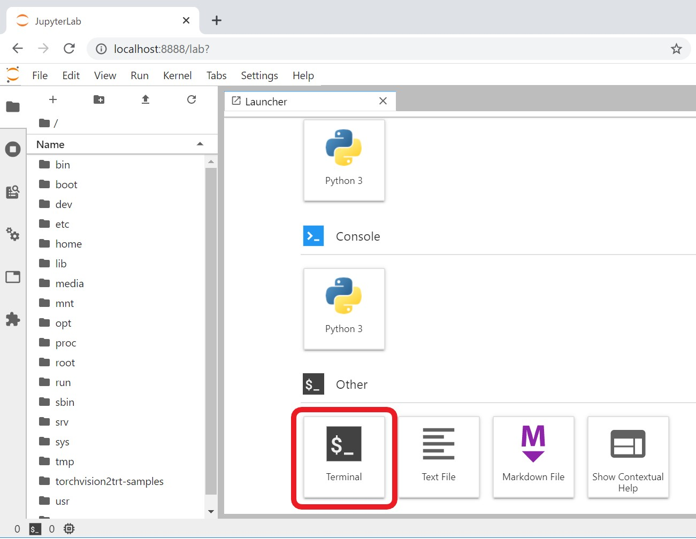

# torchvision2trt-samples

*Read this in [English](README.md)*

## このアプリケーションが行うこと
- Torchvisionで提供される学習済みディープニューラルネットワークモデル（以下、学習済みモデル）をNVIDIA TensorRT高速推論エンジンに変換する方法を解説するJupyterノートブックを提供しています。
- 併せて、NVIDIA CUDAとNVIDIA CuDNNを利用したTensorRTカスタムレイヤープラグインのサンプルコードも提示します。

## Jupyterノートブック

1. **PyTorch inference** \([torchvision_normal.ipynb](./torchvision_normal.ipynb)\)  
    PyTorchで推論する方法を解説  
    

1. **TensorRT inference with ONNX model** \([torchvision_onnx.ipynb](./torchvision_onnx.ipynb)\)  
    まず、学習済みPyTorchモデルをONNX形式に変換、次に、それをTensorRT形式に変換して推論を行います。  
    

1. **TensorRT inference with Torch-TensorRT** \([torchvision_torch_tensorrt.ipynb](./torchvision_torch_tensorrt.ipynb)\)  
    [Torch-TensorRT](https://github.com/pytorch/TensorRT) を利用して、学習済みPyTorchモデルをTensorRTにインポートする方法を解説します。  
    
    このノートブックをご利用の場合は、Dockerコンテナに別途、Torch-TensorRTをインストールいただく必要があります。詳細は [Torch-TensorRTのインストール方法](#torch-tensorrt-のインストール方法) をご覧ください。

1. **TensorRT Inference with TensorRT API** \([torchvision_trtapi.ipynb](./torchvision_trtapi.ipynb)\)  
    学習済みPyTorchモデルから重みデータとバイアスデータのみを取り出し、TensorRT APIを利用して構築したネットワーク構造に適用して、TensorRTで推論します。併せて、カスタムレイヤーを使う方法も提示します。
    

## 前提とする環境

### Jetson
- NVIDIA Jetsonシリーズの開発者キット
- NVIDIA JetPack 4.4 とそれ以降
    - Torch-TensorRT サンプル \([torchvision_torch_tensorrt.ipynb](./torchvision_torch_tensorrt.ipynb)\) をご利用の場合は JetPack 4.6以降

### dGPU
- NVIDIA GPUカードを搭載したx86 64-bitコンピューター
- [NVIDIA NGC](https://catalog.ngc.nvidia.com/) アカウント

## インストール方法（Jetson）

- **このアプリケーションはDockerfileを使ってインストールできます。ユーザーがgit cloneコマンドを実行する必要はありません。**
- **このアプリケーションはNVIDIA NGC上で公開されている[Machine Learning for Jetson/L4T](https://ngc.nvidia.com/catalog/containers/nvidia:l4t-ml) をベースにしています。**

### Docker環境の設定変更

1. デフォルトのDockerランタイムを**nvidia**に設定します。その方法は [このリンク](https://github.com/dusty-nv/jetson-containers#docker-default-runtime) をご覧ください。

1. Jetsonを再起動します。

### スワップメモリの拡張 **(Jetson Nanoのみ)**

デフォルトの2GBでは足りません。[JetsonHacks - Jetson Nano – Even More Swap](https://www.jetsonhacks.com/2019/11/28/jetson-nano-even-more-swap/) を参考に4GBに拡張してください。拡張後、再起動が必要です。

### DockerイメージをJetson上でビルド

1. DockerfileをJetsonにダウンロードします。
    ```
    git clone https://github.com/MACNICA-CLAVIS-NV/torchvision2trt-samples
    ```
1. Dockerイメージをビルドします。
    ```
    cd torchvision2trt-samples
    ```
    ```
    ./scripts/docker_build.sh
    ```

### Torch-TensorRT のインストール方法

*Torch-TensorRT sample \([torchvision_torch_tensorrt.ipynb](./torchvision_torch_tensorrt.ipynb)\) を動作させる場合にのみこのインストールが必要です。*

コンテナイメージをビルドした後、[install_torch_tensorrt](./install_torch_tensorrt.ipynb) ノートブックでTorch-TensorRTをインストールします。

1. docker_run_named.shスクリプトで、名前付き、かつ、永続的なコンテナを起動します。
    ```
    ./scripts/docker_run_named.sh
    ```

1. [localhost:8888](http://localhost:8888)をウェブブラウザで開きます。PCからリモートログインした場合は、**localhost**の部分をJetsonのIPアドレスに変更してください。
パスワードを問われますので　**"nvidia"**　を入力します。

1. install_torch_tensorrtノートブックを、**/torchvision2trt-samples**ディレクトリから見つけ、そのノートブック内に記載の指示に従い、Torch-TensorRTをインストールします。

1. Torch-TensorRTをインストールしたコンテナをコミットして、イメージを生成します。
    ```
    ./scripts/docker_commit.sh
    ```

1. 上記で生成したコンテナは削除して構いません。
    ```
    sudo docker rm my-torchvision2trt-samples
    ```

dGPUの場合の実行環境はNGCの [PyTorchイメージ](https://catalog.ngc.nvidia.com/orgs/nvidia/containers/pytorch) を基に作成されています。これらのイメージには予め、Torch-TensorRTがインストールされています。

## 実行方法

**Jetson Nano上ではメモリ不足の警告が表示される場合があります。PCからJetson Nanoへリモート接続して、PC上のウェブブラウザからJupyterノートブックを開くことでメモリ使用量が削減され、この問題に対処できます。Jetson Nanoに直接接続したディスプレイ上のL4Tデスクトップはログアウトしてください。**

1. ビルドしたイメージからコンテナを生成します。  
    **Jetson**
    ```
    ./scripts/docker_run.sh
    ```
    **dGPU**
    ```
    ./scripts/docker_run_x86.sh
    ```

1. [localhost:8888](http://localhost:8888)をウェブブラウザで開きます。PCからリモートログインした場合は、**localhost**の部分をJetsonのIPアドレスに変更してください。
パスワードを問われますので　**"nvidia"**　を入力します。

1. 下図のとおり、**/torchvision2trt-samples**ディレクトリに本アプリケーションは配置されています。


## プーリングプラグインを再ビルドする方法

1. 下図で示した**Terminal**ボタンをクリックして、ターミナルタブをオープンします。


2. 以下で示したコマンドで再ビルドできます。

    ```
    cd /torchvision2trt-samples/plugin
    ```
    ```
    rm -R build
    ```
    ```
    mkdir build
    ```
    ```
    cd build
    ```
    ```
    cmake ..
    ```
    ```
    -- The CXX compiler identification is GNU 7.5.0
    -- The CUDA compiler identification is NVIDIA 10.2.89
    -- Check for working CXX compiler: /usr/bin/c++
    -- Check for working CXX compiler: /usr/bin/c++ -- works
    -- Detecting CXX compiler ABI info
    -- Detecting CXX compiler ABI info - done
    -- Detecting CXX compile features
    -- Detecting CXX compile features - done
    -- Check for working CUDA compiler: /usr/local/cuda/bin/nvcc
    -- Check for working CUDA compiler: /usr/local/cuda/bin/nvcc -- works
    -- Detecting CUDA compiler ABI info
    -- Detecting CUDA compiler ABI info - done
    -- Looking for C++ include pthread.h
    -- Looking for C++ include pthread.h - found
    -- Looking for pthread_create
    -- Looking for pthread_create - not found
    -- Looking for pthread_create in pthreads
    -- Looking for pthread_create in pthreads - not found
    -- Looking for pthread_create in pthread
    -- Looking for pthread_create in pthread - found
    -- Found Threads: TRUE
    -- Found Protobuf: /usr/lib/aarch64-linux-gnu/libprotobuf.so;-lpthread (found version "3.0.0")
    -- Configurable variable Protobuf_VERSION set to 3.0.0
    -- Configurable variable Protobuf_INCLUDE_DIRS set to /usr/include
    -- Configurable variable Protobuf_LIBRARIES set to /usr/lib/aarch64-linux-gnu/libprotobuf.so;-lpthread
    -- Found CUDA: /usr/local/cuda (found version "10.2")
    -- Configurable variable CUDA_VERSION set to 10.2
    -- Configurable variable CUDA_INCLUDE_DIRS set to /usr/local/cuda/include
    -- Found CUDNN: /usr/include
    -- Found cuDNN: v?  (include: /usr/include, library: /usr/lib/aarch64-linux-gnu/libcudnn.so)
    -- Configurable variable CUDNN_VERSION set to ?
    -- Configurable variable CUDNN_INCLUDE_DIRS set to /usr/include
    -- Configurable variable CUDNN_LIBRARIES set to /usr/lib/aarch64-linux-gnu/libcudnn.so
    -- Configurable variable CUDNN_LIBRARY_DIRS set to
    -- Found TensorRT: /usr/lib/aarch64-linux-gnu/libnvinfer.so (found version "..")
    -- Configurable variable TensorRT_VERSION_STRING set to ..
    -- Configurable variable TensorRT_INCLUDE_DIRS set to /usr/include/aarch64-linux-gnu
    -- Configurable variable TensorRT_LIBRARIES set to /usr/lib/aarch64-linux-gnu/libnvinfer.so
    -- Configuring done
    -- Generating done
    -- Build files have been written to: /torchvision2trt-samples/plugin/build
    ```
    ```
    make
    ```
    ```
    Scanning dependencies of target PoolingPlugin
    [ 12%] Building CUDA object CMakeFiles/PoolingPlugin.dir/PoolingAlgo.cu.o
    [ 25%] Building CXX object CMakeFiles/PoolingPlugin.dir/CudaPooling.cpp.o
    [ 37%] Building CXX object CMakeFiles/PoolingPlugin.dir/trt_plugin.pb.cpp.o
    [ 50%] Building CXX object CMakeFiles/PoolingPlugin.dir/PoolingPlugin.cpp.o
    [ 62%] Building CXX object CMakeFiles/PoolingPlugin.dir/CuDnnPooling.cpp.o
    [ 75%] Building CXX object CMakeFiles/PoolingPlugin.dir/CopyPlugin.cpp.o
    [ 87%] Linking CUDA device code CMakeFiles/PoolingPlugin.dir/cmake_device_link.o
    [100%] Linking CXX shared module libPoolingPlugin.so
    [100%] Built target PoolingPlugin
    ```

## 参考

- [NVIDIA TensorRT](https://developer.nvidia.com/tensorrt)
- [Torch-TensorRT master documentation](https://pytorch.org/TensorRT/)
- [pytorch/TensorRT - GitHub](https://github.com/pytorch/TensorRT)
- [Machine Learning for Jetson/L4T](https://ngc.nvidia.com/catalog/containers/nvidia:l4t-ml)
