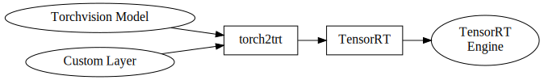

# torchvision2trt-samples

*Read this in [English](README.md)*

## このアプリケーションが行うこと
- Torchvisionで提供される学習済みディープニューラルネットワークモデル（以下、学習済みモデル）をNVIDIA TensorRT高速推論エンジンに変換する方法を解説するJupyterノートブックを提供しています。
- 併せて、NVIDIA CUDAとNVIDIA CuDNNを利用したTensorRTカスタムレイヤープラグインのサンプルコードも提示します。

## Jupyterノートブック

1. **PyTorch inference** \([torchvision_normal.ipynb](./torchvision_normal.ipynb)\)  
    PyTorchで推論する方法を解説  
    

1. **TensorRT inference with ONNX model** \([torchvision_onnx.ipynb](./torchvision_onnx.ipynb)\)  
    まず、Torchvision学習済みモデルをONNX形式に変換、次に、それをTensorRT形式に変換して推論を行います。  
    

1. **TensorRT inference with torch2trt** \([torchvision_torch2trt.ipynb](./torchvision_torch2trt.ipynb)\)  
    [torch2trt](https://github.com/NVIDIA-AI-IOT/torch2trt)を利用して、PyTorchモデルをTensorRTにインポートする方法を解説します。併せて、カスタムレイヤーを使う方法も提示します。  
    

1. **TensorRT Inference with TensorRT API** \([torchvision_trtapi.ipynb](./torchvision_trtapi.ipynb)\)  
    学習済みPyTorchモデルから重みデータとバイアスデータのみを取り出し、TensorRT APIを利用して構築したネットワーク構造に適用して、TensorRTで推論します。  
    

## 前提とする環境
- NVIDIA Jetsonシリーズの開発者キット
- NVIDIA JetPack 4.4 とそれ以降

## インストール方法

**このアプリケーションはDockerfileを使ってインストールできます。ユーザーがgit cloneコマンドを実行する必要はありません。**

### Docker環境の設定変更

1. デフォルトのDockerランタイムを**nvidia**に設定します。詳細は [このリンク](https://github.com/dusty-nv/jetson-containers#docker-default-runtime)をご覧ください。
1. CuDNN関連ヘッダファイルがDockerコンテナ内から見つけられない問題を修正します。**(Jetson Nano向けJetPack 4.4DP SDカードを利用した場合)**
    1. 以下のとおりパッチファイルをダウンロードします。
        ```
        $ wget https://raw.githubusercontent.com/MACNICA-CLAVIS-NV/torchvision2trt-samples/master/cudnn_csv_patch_jp4_4dp.txt
        ```
    1. 元の設定ファイルをバックアップしておきます。
        ```
        $ cp /etc/nvidia-container-runtime/host-files-for-container.d/cudnn.csv ./cudnn.csv.bak
        ```
    1. 設定ファイルにパッチを適用します。
        ```
        $ sudo patch -u /etc/nvidia-container-runtime/host-files-for-container.d/cudnn.csv <cudnn_csv_patch_jp4_4dp.txt
        ```
1. 設定ファイルの改行コードを修正します。詳細は[このリンク](https://github.com/dusty-nv/jetson-containers/issues/3#issuecomment-638541303)参照してください。**(JetPack 4.4DPのみ)**
    ```
    $ sudo apt update
    $ sudo apt install dos2unix
    $ sudo dos2unix /etc/nvidia-container-runtime/host-files-for-container.d/cudnn.csv
    ```

1. Jetsonを再起動します。

### スワップメモリの拡張 **(Jetson Nanoのみ)**

デフォルトの2GBでは足りません。[JetsonHacks - Jetson Nano – Even More Swap](https://www.jetsonhacks.com/2019/11/28/jetson-nano-even-more-swap/)を参考に4GBに拡張してください。

### DockerイメージをJetson上でビルド

1. DockerfileをJetsonにダウンロードします。
    ```
    $ wget https://raw.githubusercontent.com/MACNICA-CLAVIS-NV/torchvision2trt-samples/master/Dockerfile
    ```
1. Dockerイメージをビルドします。
    ```
    $ sudo docker build -t torchvision2trt-samples:1 .
    ```

## 実行方法

**Jetson Nano上ではメモリ不足の警告が表示される場合があります。PCからJetson Nanoへリモート接続して、PC上のウェブブラウザからJupyterノートブックを開くことで、この問題に対処できます。Jetson Nanoに直接接続したディスプレイ上のL4Tデスクトップはログアウトしてください。**

1. ビルドしたイメージからコンテナを生成します。
    ```
    $ sudo docker run -it --rm --net=host --runtime nvidia -e DISPLAY=$DISPLAY -v /tmp/.X11-unix/:/tmp/.X11-unix -v $HOME:$HOME torchvision2trt-samples:1
    ```
1. [localhost:8888](http://localhost:8888)をウェブブラウザで開きます。PCからリモートログインした場合は、**localhost**の部分をJetsonのIPアドレスに変更してください。
パスワードを問われますので**"nvidia"**を入力します。

1. 下図のとおり、**/torchvision2trt-samples**ディレクトリに本アプリケーションは配置されています。


## プーリングプラグインを再ビルドする方法

1. 下図で示した**Terminal**ボタンをクリックして、ターミナルタブをオープンします。


2. 以下で示したコマンドで再ビルドできます。

    ```
    # cd /torchvision2trt-samples/plugin

    # rm -R build

    # mkdir build

    # cd build

    # cmake ..
    -- The CXX compiler identification is GNU 7.5.0
    -- The CUDA compiler identification is NVIDIA 10.2.89
    -- Check for working CXX compiler: /usr/bin/c++
    -- Check for working CXX compiler: /usr/bin/c++ -- works
    -- Detecting CXX compiler ABI info
    -- Detecting CXX compiler ABI info - done
    -- Detecting CXX compile features
    -- Detecting CXX compile features - done
    -- Check for working CUDA compiler: /usr/local/cuda/bin/nvcc
    -- Check for working CUDA compiler: /usr/local/cuda/bin/nvcc -- works
    -- Detecting CUDA compiler ABI info
    -- Detecting CUDA compiler ABI info - done
    -- Looking for C++ include pthread.h
    -- Looking for C++ include pthread.h - found
    -- Looking for pthread_create
    -- Looking for pthread_create - not found
    -- Looking for pthread_create in pthreads
    -- Looking for pthread_create in pthreads - not found
    -- Looking for pthread_create in pthread
    -- Looking for pthread_create in pthread - found
    -- Found Threads: TRUE
    -- Found Protobuf: /usr/lib/aarch64-linux-gnu/libprotobuf.so;-lpthread (found version "3.0.0")
    -- Configurable variable Protobuf_VERSION set to 3.0.0
    -- Configurable variable Protobuf_INCLUDE_DIRS set to /usr/include
    -- Configurable variable Protobuf_LIBRARIES set to /usr/lib/aarch64-linux-gnu/libprotobuf.so;-lpthread
    -- Found CUDA: /usr/local/cuda (found version "10.2")
    -- Configurable variable CUDA_VERSION set to 10.2
    -- Configurable variable CUDA_INCLUDE_DIRS set to /usr/local/cuda/include
    -- Found CUDNN: /usr/include
    -- Found cuDNN: v?  (include: /usr/include, library: /usr/lib/aarch64-linux-gnu/libcudnn.so)
    -- Configurable variable CUDNN_VERSION set to ?
    -- Configurable variable CUDNN_INCLUDE_DIRS set to /usr/include
    -- Configurable variable CUDNN_LIBRARIES set to /usr/lib/aarch64-linux-gnu/libcudnn.so
    -- Configurable variable CUDNN_LIBRARY_DIRS set to
    -- Found TensorRT: /usr/lib/aarch64-linux-gnu/libnvinfer.so (found version "..")
    -- Configurable variable TensorRT_VERSION_STRING set to ..
    -- Configurable variable TensorRT_INCLUDE_DIRS set to /usr/include/aarch64-linux-gnu
    -- Configurable variable TensorRT_LIBRARIES set to /usr/lib/aarch64-linux-gnu/libnvinfer.so
    -- Configuring done
    -- Generating done
    -- Build files have been written to: /torchvision2trt-samples/plugin/build

    # make
    Scanning dependencies of target PoolingPlugin
    [ 12%] Building CUDA object CMakeFiles/PoolingPlugin.dir/PoolingAlgo.cu.o
    [ 25%] Building CXX object CMakeFiles/PoolingPlugin.dir/CudaPooling.cpp.o
    [ 37%] Building CXX object CMakeFiles/PoolingPlugin.dir/trt_plugin.pb.cpp.o
    [ 50%] Building CXX object CMakeFiles/PoolingPlugin.dir/PoolingPlugin.cpp.o
    [ 62%] Building CXX object CMakeFiles/PoolingPlugin.dir/CuDnnPooling.cpp.o
    [ 75%] Building CXX object CMakeFiles/PoolingPlugin.dir/CopyPlugin.cpp.o
    [ 87%] Linking CUDA device code CMakeFiles/PoolingPlugin.dir/cmake_device_link.o
    [100%] Linking CXX shared module libPoolingPlugin.so
    [100%] Built target PoolingPlugin
    ```
