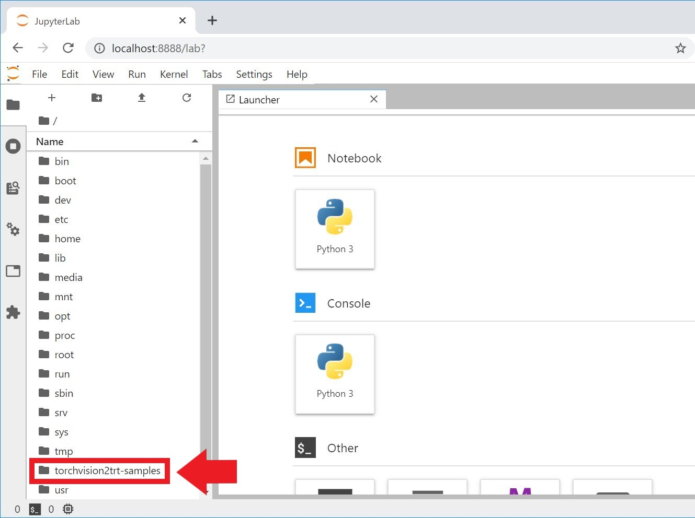

# torchvision2trt-samples

## What does this application do?
- This repository provides a colletion of Jupyer notebooks to demonstrate on how to convert Torchvision pre-trained models to NVIDIA TensorRT.
- You can also understand how to develop TensorRT custom layer with NVIDIA CUDA and NVIDIA CuDNN with a sample TensorRT plugin contained in this repository.

## Prerequisites
- NVIDIA Jetson Series Developer Kits
- NVIDIA JetPack 4.4 or later

## Installation

**This application can be installed with Dockerfile so that you don't need to clone this repository manually.**

### Change docker configuration

1. Set the default docker runtime to **nvidia** as described at [this link](https://github.com/dusty-nv/jetson-containers#docker-default-runtime)
1. Fix the CuDNN haeder file missing issue.**(Only for JetPack 4.4DP SD card image for Jetson Nano)**
    1. Download the patch.
        ```
        $ wget https://raw.githubusercontent.com/MACNICA-CLAVIS-NV/torchvision2trt-samples/master/cudnn_csv_patch_jp4_4dp.txt
        ```
    1. Back up the original configuration file
        ```
        $ cp /etc/nvidia-container-runtime/host-files-for-container.d/cudnn.csv ./cudnn.csv.bak
        ```
    1. Patch the configuration file
        ```
        $ sudo patch -u /etc/nvidia-container-runtime/host-files-for-container.d/cudnn.csv <cudnn_csv_patch_jp4_4dp.txt
        ``` 
1. Fix the line breaks of the configuration file
    ```
    $ sudo apt update
    $ sudo apt install dos2unix
    $ sudo dos2unix /etc/nvidia-container-runtime/host-files-for-container.d/cudnn.csv
    ```

1. Reboot your Jetson

### Increase swap memory **(Only for Jetson Nano)**

The default 2GB swap memory is insufficient. Increse it to 4GB as described at [JetsonHacks - Jetson Nano – Even More Swap](https://www.jetsonhacks.com/2019/11/28/jetson-nano-even-more-swap/)

### Build a docker image locally

1. Download the Dockerfile to your Jetson developer kit.
    ```
    $ wget https://raw.githubusercontent.com/MACNICA-CLAVIS-NV/torchvision2trt-samples/master/Dockerfile
    ```
1. Build a docker image
    ```
    $ sudo docker build -t torchvision2trt-samples:1 .
    ```

## Usage

1. Run a docker container generated from the image built as the above.
    ```
    $ sudo docker run -it --rm --net=host --runtime nvidia -e DISPLAY=$DISPLAY -v /tmp/.X11-unix/:/tmp/.X11-unix -v $HOME:$HOME torchvision2trt-samples:1
    ```
1. Open [localhost:8888](http://localhost:8888) from Web browser.

1. You can find these samples at the /torchvision2trt-samples directory as the following picture.

