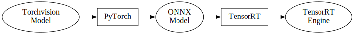
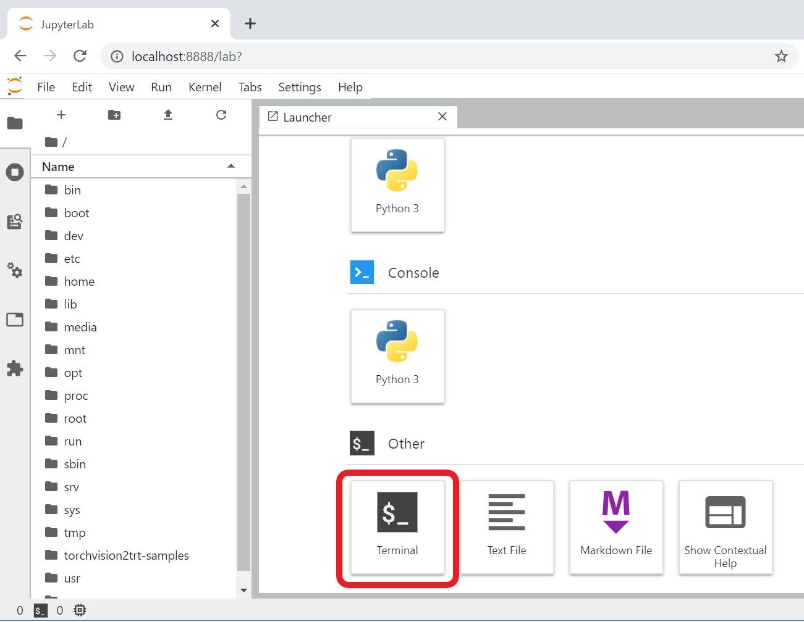

# torchvision2trt-samples

*Read this in Japanese [日本語](README.jp.md)*

## What does this application do?
- This repository provides a colletion of Jupyer notebooks to demonstrate on how to convert Torchvision pre-trained models to NVIDIA TensorRT.
- You can also understand how to develop TensorRT custom layer with NVIDIA CUDA and NVIDIA CuDNN with a sample TensorRT plugin contained in this repository.

## Jupyter notebooks

1. **PyTorch inference** \([torchvision_normal.ipynb](./torchvision_normal.ipynb)\)  
    This notebook shows how to do inference by GPU in PyTorch.  
    

1. **TensorRT inference with ONNX model** \([torchvision_onnx.ipynb](./torchvision_onnx.ipynb)\)  
    This notebook shows how to convert a pre-trained PyTorch model to a ONNX model first, and also shows how to do inference by TensorRT with the ONNX model.  
    

1. **TensorRT inference with torch2trt** \([torchvision_torch2trt.ipynb](./torchvision_torch2trt.ipynb)\)  
    This notebook shows how to import a pre-trained PyTorch model to TensorRT with [torch2trt](https://github.com/NVIDIA-AI-IOT/torch2trt). This notebook also shows how to use custom layers with torch2trt.  
    

1. **TensorRT Inference with TensorRT API** \([torchvision_trtapi.ipynb](./torchvision_trtapi.ipynb)\)  
    This notebook  shows how to import a pre-trained PyTorch model data (weights and bias) with a user-defined network with the TensorRT API. This notebook also shows how to use custom layers with the TensorRT API.  
    

## Prerequisites
- NVIDIA Jetson Series Developer Kits
- NVIDIA JetPack 4.4 or later

## Installation

- **This application can be installed with Dockerfile so that you don't need to clone this repository manually.**
- **This application will be built on [Machine Learning for Jetson/L4T](https://ngc.nvidia.com/catalog/containers/nvidia:l4t-ml) which is distributed from NVIDIA NGC.**

### Change docker configuration

1. Set the default docker runtime to **nvidia** as described at [this link](https://github.com/dusty-nv/jetson-containers#docker-default-runtime)
1. Fix the CuDNN haeder file missing issue **(Only for JetPack 4.4DP SD card image for Jetson Nano)**
    1. Download the patch.
        ```
        $ wget https://raw.githubusercontent.com/MACNICA-CLAVIS-NV/torchvision2trt-samples/master/cudnn_csv_patch_jp4_4dp.txt
        ```
    1. Back up the original configuration file
        ```
        $ cp /etc/nvidia-container-runtime/host-files-for-container.d/cudnn.csv ./cudnn.csv.bak
        ```
    1. Patch the configuration file
        ```
        $ sudo patch -u /etc/nvidia-container-runtime/host-files-for-container.d/cudnn.csv <cudnn_csv_patch_jp4_4dp.txt
        ``` 
1. Fix the line breaks of the configuration file as described at [this link](https://github.com/dusty-nv/jetson-containers/issues/3#issuecomment-638541303)  **(Only for JetPack 4.4DP)**
    ```
    $ sudo apt update
    $ sudo apt install dos2unix
    $ sudo dos2unix /etc/nvidia-container-runtime/host-files-for-container.d/cudnn.csv
    ```

1. Reboot your Jetson

### Increase swap memory **(Only for Jetson Nano)**

The default 2GB swap memory is insufficient. Increse it to 4GB as described at [JetsonHacks - Jetson Nano – Even More Swap](https://www.jetsonhacks.com/2019/11/28/jetson-nano-even-more-swap/)

### Build a docker image locally

1. Download the Dockerfile to your Jetson developer kit.
    ```
    $ wget https://raw.githubusercontent.com/MACNICA-CLAVIS-NV/torchvision2trt-samples/master/Dockerfile
    ```
1. Build a docker image
    ```
    $ sudo docker build -t torchvision2trt-samples:1 .
    ```

## Usage

**For Jetson Nano, you sometimes see the low memory warning on Jetson's L4T desktop while you run these notebooks. To run these notebooks on Jetson Nano, logout the desktop, and login to the Jetson Nano from your PC with network access, and open these notebooks in a Web browser of your PC remotely. It seems that this method reduces Jetson Nano's memory usage.**

1. Run a docker container generated from the image built as the above.
    ```
    $ sudo docker run -it --rm --net=host --runtime nvidia -e DISPLAY=$DISPLAY -v /tmp/.X11-unix/:/tmp/.X11-unix -v $HOME:$HOME torchvision2trt-samples:1
    ```
1. Open [localhost:8888](http://localhost:8888) from Web browser, and input the password **"nvidia"**.

1. You can find these samples at the **/torchvision2trt-samples** directory as the following picture.


## How to rebuild the pooling plugin library

1. Open a terminal (Click the terminal button as shown in the following figure.)  


2. Follow the following the following instruction.

    ```
    # cd /torchvision2trt-samples/plugin

    # rm -R build

    # mkdir build

    # cd build

    # cmake ..
    -- The CXX compiler identification is GNU 7.5.0
    -- The CUDA compiler identification is NVIDIA 10.2.89
    -- Check for working CXX compiler: /usr/bin/c++
    -- Check for working CXX compiler: /usr/bin/c++ -- works
    -- Detecting CXX compiler ABI info
    -- Detecting CXX compiler ABI info - done
    -- Detecting CXX compile features
    -- Detecting CXX compile features - done
    -- Check for working CUDA compiler: /usr/local/cuda/bin/nvcc
    -- Check for working CUDA compiler: /usr/local/cuda/bin/nvcc -- works
    -- Detecting CUDA compiler ABI info
    -- Detecting CUDA compiler ABI info - done
    -- Looking for C++ include pthread.h
    -- Looking for C++ include pthread.h - found
    -- Looking for pthread_create
    -- Looking for pthread_create - not found
    -- Looking for pthread_create in pthreads
    -- Looking for pthread_create in pthreads - not found
    -- Looking for pthread_create in pthread
    -- Looking for pthread_create in pthread - found
    -- Found Threads: TRUE  
    -- Found Protobuf: /usr/lib/aarch64-linux-gnu/libprotobuf.so;-lpthread (found version "3.0.0") 
    -- Configurable variable Protobuf_VERSION set to 3.0.0
    -- Configurable variable Protobuf_INCLUDE_DIRS set to /usr/include
    -- Configurable variable Protobuf_LIBRARIES set to /usr/lib/aarch64-linux-gnu/libprotobuf.so;-lpthread
    -- Found CUDA: /usr/local/cuda (found version "10.2") 
    -- Configurable variable CUDA_VERSION set to 10.2
    -- Configurable variable CUDA_INCLUDE_DIRS set to /usr/local/cuda/include
    -- Found CUDNN: /usr/include  
    -- Found cuDNN: v?  (include: /usr/include, library: /usr/lib/aarch64-linux-gnu/libcudnn.so)
    -- Configurable variable CUDNN_VERSION set to ?
    -- Configurable variable CUDNN_INCLUDE_DIRS set to /usr/include
    -- Configurable variable CUDNN_LIBRARIES set to /usr/lib/aarch64-linux-gnu/libcudnn.so
    -- Configurable variable CUDNN_LIBRARY_DIRS set to 
    -- Found TensorRT: /usr/lib/aarch64-linux-gnu/libnvinfer.so (found version "..") 
    -- Configurable variable TensorRT_VERSION_STRING set to ..
    -- Configurable variable TensorRT_INCLUDE_DIRS set to /usr/include/aarch64-linux-gnu
    -- Configurable variable TensorRT_LIBRARIES set to /usr/lib/aarch64-linux-gnu/libnvinfer.so
    -- Configuring done
    -- Generating done
    -- Build files have been written to: /torchvision2trt-samples/plugin/build

    # make
    Scanning dependencies of target PoolingPlugin
    [ 12%] Building CUDA object CMakeFiles/PoolingPlugin.dir/PoolingAlgo.cu.o
    [ 25%] Building CXX object CMakeFiles/PoolingPlugin.dir/CudaPooling.cpp.o
    [ 37%] Building CXX object CMakeFiles/PoolingPlugin.dir/trt_plugin.pb.cpp.o
    [ 50%] Building CXX object CMakeFiles/PoolingPlugin.dir/PoolingPlugin.cpp.o
    [ 62%] Building CXX object CMakeFiles/PoolingPlugin.dir/CuDnnPooling.cpp.o
    [ 75%] Building CXX object CMakeFiles/PoolingPlugin.dir/CopyPlugin.cpp.o
    [ 87%] Linking CUDA device code CMakeFiles/PoolingPlugin.dir/cmake_device_link.o
    [100%] Linking CXX shared module libPoolingPlugin.so
    [100%] Built target PoolingPlugin
    ```

## References

- [NVIDIA TensorRT](https://developer.nvidia.com/tensorrt)
- [NVIDIA-AI-IOT/torch2trt](https://github.com/NVIDIA-AI-IOT/torch2trt)
- [Developing Real-time Neural Networks for Jetson](https://www.nvidia.com/en-us/gtc/on-demand/?search=22676)
- [Machine Learning for Jetson/L4T](https://ngc.nvidia.com/catalog/containers/nvidia:l4t-ml)
